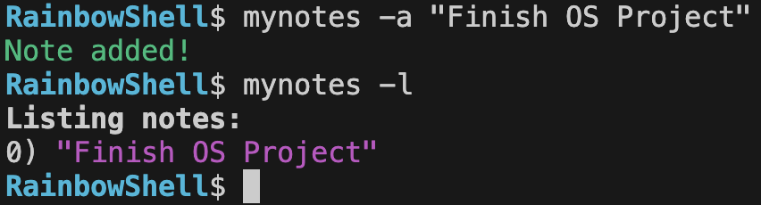
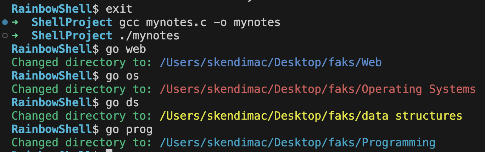

<!DOCTYPE html>
<html lang="en">
<head>
  <meta charset="UTF-8">
  <title>Shell Project README</title>
  
</head>
<body>

<h1>Shell Project</h1>

  A custom Unix-like shell written in C. Implements process creation, built-in commands,
  parsing user input, handling redirection, piping, and more.

  <!-- Optionally, you can drop an image or banner here -->
  <!-- e.g.  -->

<h2>Table of Contents</h2>
<ul>
  <li><a href="#overview">Overview</a></li>
  <li><a href="#features">Features</a></li>
  <li><a href="#directory-structure">Directory Structure</a></li>
  <li><a href="#build-and-run">Build and Run</a></li>
  <li><a href="#usage">Usage</a></li>
  <li><a href="#built-in-commands">Built-in Commands</a></li>
  <li><a href="#examples-and-screenshots">Examples and Screenshots</a></li>
  <li><a href="#implementation-details">Implementation Details</a></li>
  <li><a href="#known-issues--limitations">Issues </a></li>
  <li><a href="#contact--credits">Contact / Credits</a></li>
</ul>

<h2 id="overview">Overview</h2>

  This project is part of an Operating Systems course assignment. It demonstrates
  low-level process management, parsing, and system calls like <code>fork()</code>,
  <code>execvp()</code>, <code>wait()</code>, <code>pipe()</code>, <code>dup2()</code>, etc.
  By building a shell, we gain insight into how a real shell interprets commands, spawns
  processes, and handles I/O redirection.

<strong>Key Concepts:</strong>

<ul>
  <li>Process creation (<code>fork()</code>)</li>
  <li>Program replacement (<code>exec()</code>)</li>
  <li>Synchronization (<code>wait()</code>)</li>
  <li>File descriptor manipulation (<code>dup2()</code>, <code>pipe()</code>)</li>
  <li>In-memory data structures (history, notes, etc.)</li>
</ul>

<h2 id="features">Features</h2>
<ul>
  <li><strong>Prompt</strong>
    <ul>
      <li>Basic: <code>prompt$</code></li>
      <li>Advanced: <code>machinename@username:~$</code></li>
    </ul>
  </li>
  <li><strong>Built-in Commands</strong>
    <ul>
      <li><code>mynotes -a "text"</code>, <code>mynotes -l</code> for note-taking</li>
      <li><code>go web</code>, <code>go os</code> to jump to preset directories</li>
      <li><em>(Optional)</em> <code>history</code>, <code>cp -v</code>, or any other custom commands</li>
    </ul>
  </li>
  <li><strong>External Commands</strong>
    <ul>
      <li>Full support for running programs via <code>execvp()</code>, e.g., <code>ls -l</code>, <code>gcc main.c -o main</code>, etc.</li>
    </ul>
  </li>
  <li><strong>Basic I/O Redirection</strong> (<code>&gt;</code>, <code>&lt;</code>)</li>
  <li><strong>Piping</strong> (<code>|</code>) (optional or advanced)</li>
</ul>

<h2 id="directory-structure">Directory Structure</h2>

<pre><code>ShellProject/
├── src/
│   ├── main.c          // Main entry point, shell loop, prompt printing
│   ├── builtins.c      // Built-in commands implementation
│   ├── parse.c         // Command-line parsing logic
│   ├── notes.c         // Example: "mynotes" code
│   ├── ...
│   └── headers/        // .h files for function prototypes, data structures
├── Makefile            // or a build script
├── README.md           // This file
└── images/             // Place screenshots, diagrams, etc.
</code></pre>

  You can organize your code in a single file or multiple files as you prefer, but
  the above layout is an example of a more modular approach.

<h2 id="build-and-run">Build and Run</h2>
<ol>
  <li><strong>Clone or download</strong> this repository.</li>
  <li><strong>Open a terminal</strong> in the project directory.</li>
  <li><strong>Build</strong> using your chosen method:</li>
</ol>

<pre><code># If using a Makefile
make
</code></pre>

or

<pre><code># Without a Makefile, compile main + any other source files
gcc src/main.c src/builtins.c src/parse.c -o myShell
</code></pre>

<ol start="4">
  <li><strong>Run</strong> the shell:</li>
</ol>

<pre><code>./myShell
</code></pre>

  You should see a prompt like:

<pre><code>prompt$
</code></pre>

  or (in advanced mode):

<pre><code>machinename@username:~$
</code></pre>

<h2 id="usage">Usage</h2>

  Once running:

<ul>
  <li>Type commands (e.g., <code>ls</code>, <code>pwd</code>, etc.) and press <strong>Enter</strong>.</li>
  <li>Use <strong>built-in commands</strong> (see below).</li>
  <li>Use <strong>redirection</strong>: e.g., <code>ls &gt; out.txt</code>.</li>
  <li>Use <strong>piping</strong>: e.g., <code>ls | grep main</code>.</li>
  <li>Type <code>exit</code> or press <strong>Ctrl+D</strong> to quit the shell.</li>
</ul>

<h2 id="built-in-commands">Built-in Commands</h2>

<table>
  <thead>
    <tr>
      <th>Command</th>
      <th>Description</th>
      <th>Example</th>
    </tr>
  </thead>
  <tbody>
    <tr>
      <td><code>mynotes -a "text"</code></td>
      <td>Add a new note to the in-memory list</td>
      <td><code>mynotes -a "Buy groceries"</code></td>
    </tr>
    <tr>
      <td><code>mynotes -l</code></td>
      <td>List all notes currently stored</td>
      <td><code>mynotes -l</code></td>
    </tr>
    <tr>
      <td><code>go web</code></td>
      <td>Quickly navigate to the "Web" folder</td>
      <td><code>go web</code></td>
    </tr>
    <tr>
      <td><code>go os</code></td>
      <td>Navigate to the "Operating Systems" folder</td>
      <td><code>go os</code></td>
    </tr>
    <tr>
      <td><code>exit</code></td>
      <td>Quit the shell</td>
      <td><code>exit</code></td>
    </tr>
    <tr>
      <td><em>(Optional)</em> <code>history</code></td>
      <td>Show all previously executed commands</td>
      <td><code>history</code></td>
    </tr>
    <tr>
      <td><em>(Optional)</em> <code>cp -v src dst</code></td>
      <td>Copy file from src to dst with verbose info</td>
      <td><code>cp -v file1 file2</code></td>
    </tr>
  </tbody>
</table>

  Feel free to add <strong>flags</strong>, arguments, or custom logic that 
  <em>doesn’t exist</em> in standard shells—this is part of the creativity requirement.

<h2 id="examples-and-screenshots">Examples and Screenshots</h2>

Here’s an example session with <code>mynotes</code> and <code>go</code>:

   -->
   -->

<h2 id="implementation-details">Implementation Details</h2>

<strong>Parsing:</strong>

<ul>
  <li>We use <code>strtok()</code> to split user input on whitespace.</li>
  <li>For redirection or piping, we might parse <code>&gt;</code> or <code>|</code> specially
      and handle them with <code>dup2()</code>, <code>pipe()</code>, etc.</li>
</ul>

<strong>Process Creation:</strong>

<ul>
  <li>On non-built-in commands, we <code>fork()</code> a child and 
      <code>execvp(args[0], args)</code>.</li>
  <li>The parent shell does a <code>wait(NULL)</code> to synchronize.</li>
</ul>

<strong>Error Handling:</strong>

<ul>
  <li>We handle invalid commands by printing an error and continuing.</li>
  <li>We also handle partial user input (e.g., if <code>cp</code> is missing arguments).</li>
</ul>

<strong>Data Structures:</strong>

<ul>
  <li>We store notes in a static array. The entire shell is purely in-memory for now.
      If you close the shell, notes are lost unless you implement saving logic.</li>
</ul>

<h2 id="known-issues--limitations">Known Issues / Limitations</h2>
<ul>
  <li><strong>No Persistent Storage</strong>: By default, <code>mynotes</code> doesn’t write
      to disk, so notes disappear when you exit.</li>
  <li><strong>Limited Redirection/Piping</strong>: Only partial support for multiple pipes,
      advanced quoting, or background processes.</li>
  <li><strong>No Support for Some Bash Features</strong>: Variables, wildcards, job control, etc.
      are not fully implemented.</li>
</ul>

<h2 id="contact--credits">People on the project:</h2>
<ul>
  <li><strong>Student</strong>: Tarik Skender</li>
  <li><strong>Student</strong>: Bekir Nokić</li>
</ul>

<strong>End of README</strong>.

</body>
</html>
